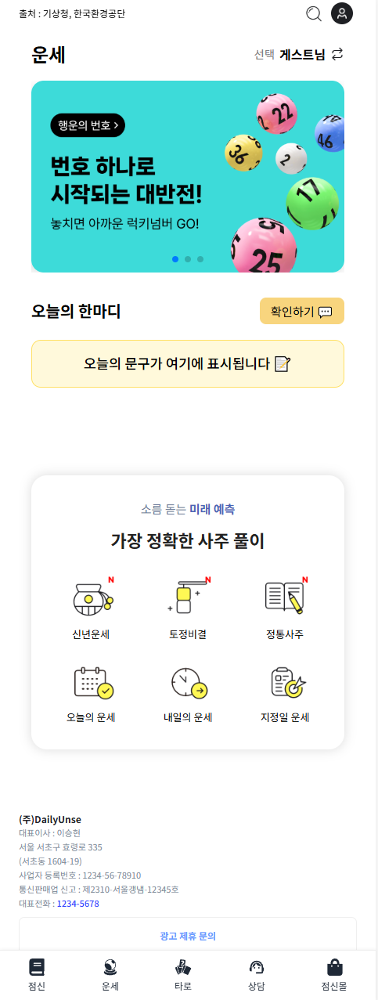
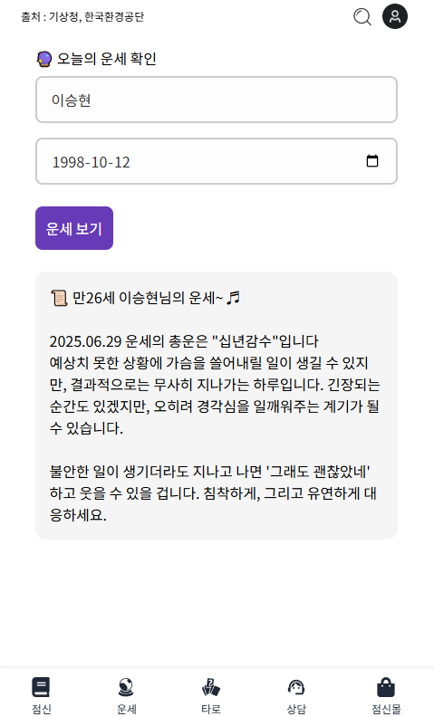
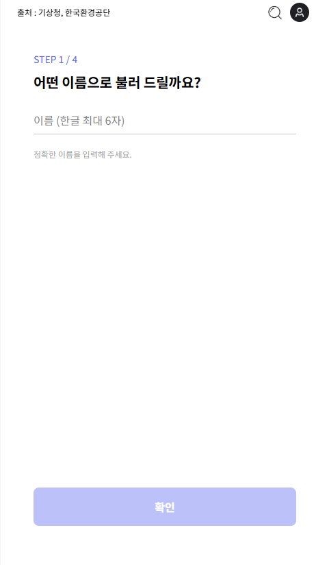
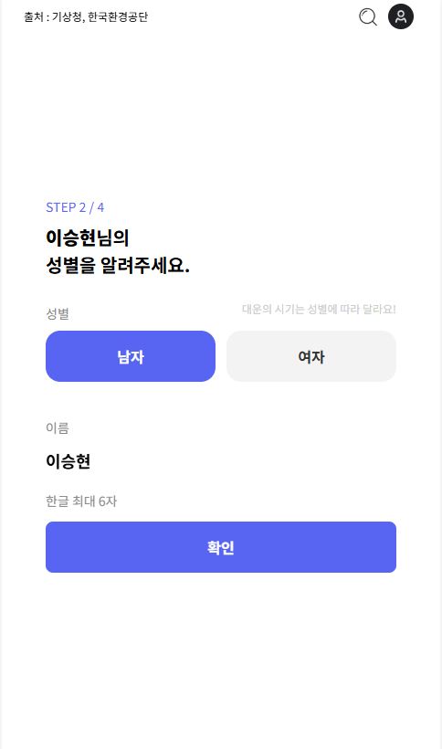
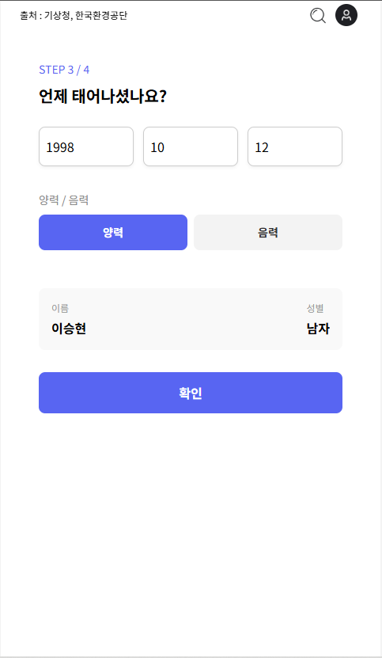
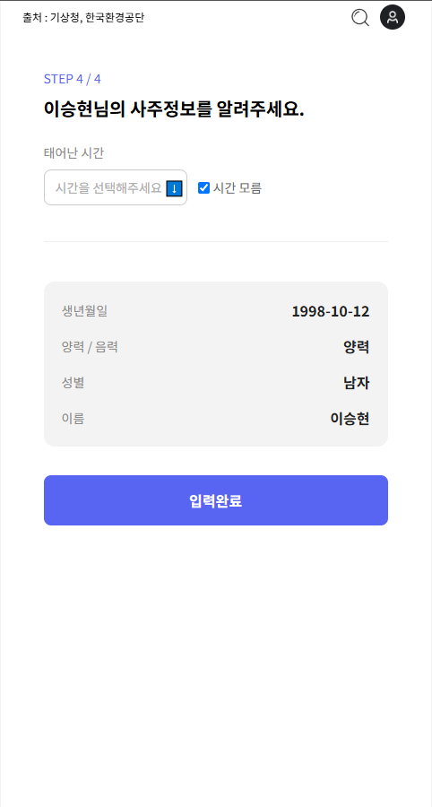
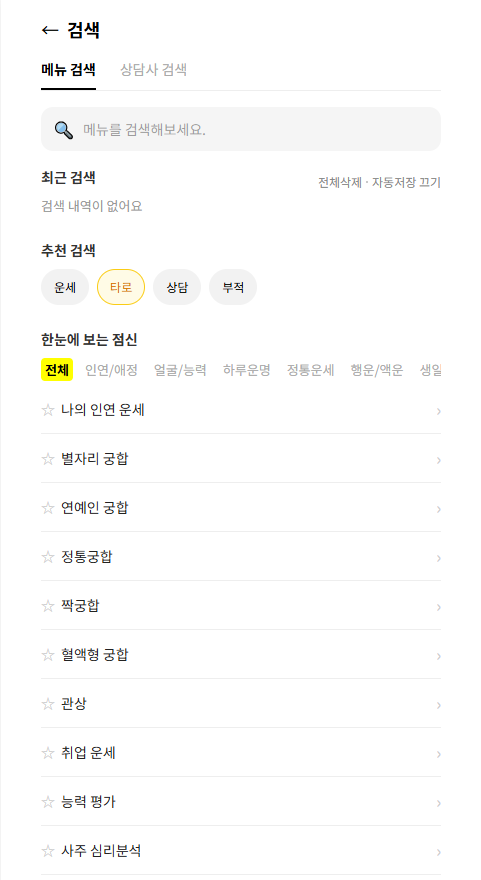
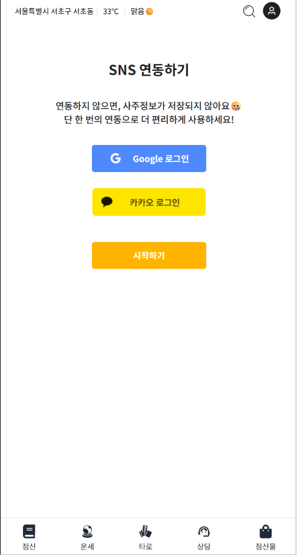
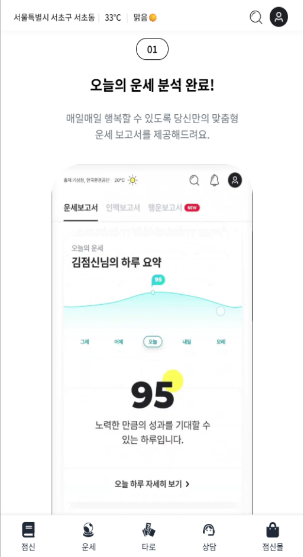

# 🔮 DailyUnse

운세를 확인할 수 있는 모바일 중심 웹 서비스.  


---

## 📌 프로젝트 요약

- **프로젝트명**: DailyUnse
- **목표**: 사용자 친화적인 UI로 오늘의 운세를 간단하게 제공하는 모바일 웹사이트 제작
- **기술 스택**:  
  - Frontend: `React`, `TypeScript`, `Styled-Components`, `React Router`, `Swiper`
  - API 연동: `카카오 API`, `기상청 API`, `로컬 JSON`
  - 인증: `Google`, `Kakao OAuth`
- **팀원 구성**:  
  - 이승현: 점신 페이지 / 메인 운세 페이지 / Swiper
  - 박혜원: 레이아웃 (Header/Footer/Nav) / CSS / 서비스 페이지
  - 정은선: 로그인 플로우 / 검색 UI / 운세 컨텐츠
  - 박영성: PM / 자료조사

---

## 🧠 기획 의도

-데스크탑 뿐만 아니라 모바일을 고려한 디자인을 선정하여 모바일웹인 점신(https://www.jeomsin.co.kr/) 사이트를  클론코딩

-React와 Swiper, 커스텀 훅을 활용하여 클론 프로젝트로 개발

---

## 🛠 주요 기능 (Features)

| 기능 | 설명 |
|------|------|
| ✅ 오늘의 운세 조회 | 이름/생년월일 입력 → 만 나이 계산 → 랜덤 운세 제공 |
| ✅ Swiper 배너 | React Swiper를 이용한 자동 슬라이드 배너 구성 |
| ✅ 현재 날씨 위젯 | 카카오 위치 API + 기상청 날씨 API 연동 |
| ✅ 로그인 플로우 | 비회원 → 성별 → 생년월일 → 출생시간 입력 흐름 |
| ✅ 검색 페이지 | 메뉴/상담사 검색 탭, 자동 저장, 즐겨찾기 기능 |
| ✅ 점신 페이지 | React Swiper를 이용한 세로 슬라이드 방식의 풀페이지 형 UI 구현 |
| ✅ 소셜 로그인 | 구글/카카오 OAuth 통합 로그인 지원 |

---

## 📷 결과 화면 예시

> (아래 스크린샷은 실제 구현된 결과를 캡쳐하여 삽입)

<table>
  <tr>
    <td align="center" valign="top">
      <b>🏠 메인 운세 페이지</b><br/>
      
    </td>
    <td align="center" valign="top">
      <b>📝 오늘의 운세 결과</b><br/>
      
    </td>
  </tr>
  <tr>
    <td align="center" valign="top">
      <b>🔐 로그인 입력 단계 (1~4)</b><br/>
      
      
      <br/>
      
      
    </td>
    <td align="center" valign="top">
      <b>🔍 검색 페이지</b><br/>
      
    </td>
  </tr>
  <tr>
    <td align="center" valign="top">
      <b>📲 소셜 로그인</b><br/>
      
    </td>
    <td align="center" valign="top">
      <b>🔮 점신 페이지 (Fullpage Slide)</b><br/>
      
    </td>
  </tr>
</table>
---

## ⚙️ 비기능 요건 (Non-Functional)

- 반응형 UI 및 모바일 웹 최적화
- 성능 최적화 (불필요한 렌더링 최소화)
- 커스텀 훅 사용으로 공통 로직 추출
- 조건부 렌더링 및 props/state 분리 설계
- API 과금 회피를 위한 mock 데이터 전략

---

## 🚀 추후 확장 계획

| 항목 | 내용 |
|------|------|
| 🔮 운세 추천 알고리즘 | 생년월일 기반 개인 맞춤형 운세 제공 |
| 🧠 AI 운세 챗봇 | GPT API를 이용한 대화형 운세 시스템 |
| 💰 유료 운세 서비스 | 프리미엄 운세, 정밀 해석, 결제 연동 |
| 📲 SNS 공유 기능 | 카카오톡 등으로 운세 결과 공유 |
| 📚 유저 대시보드 | 최근 기록, 즐겨찾기, 통계 기능 등 |

---

## 🧪 프로젝트 사용 방법 (Usage)

### 1. 프로젝트 클론
```bash
git clone https://github.com/your-username/DailyUnse.git
cd DailyUnse
npm install
```
### 2. 실행
```bash
npm run start
```
